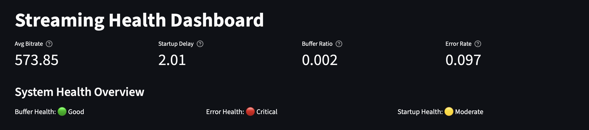
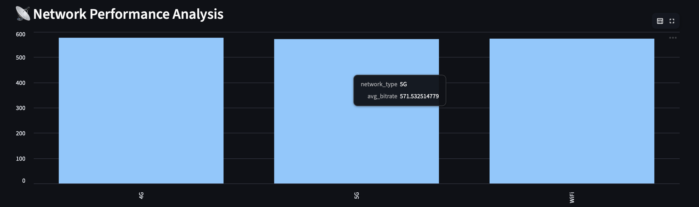
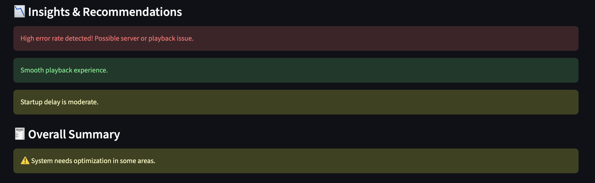

# Streaming Health Analytics System

A Netflix-inspired **real-time streaming analytics dashboard** that monitors video playback performance and provides actionable insights into system health.

---

## Overview

This project simulates how modern streaming platforms analyze playback data to ensure smooth user experience.

It processes video logs and answers:
- Is the system healthy?  
- Are users facing buffering issues?  
- Which network performs best?  

---

## Features

### 📊 Data Simulation
- Generates 20,000+ realistic streaming logs
- Includes:
  - Bitrate (video quality)
  - Buffering events
  - Startup delay
  - Error codes
  - Device & network type

---

### Backend API (Flask)
- `/metrics` → Core KPIs
- `/network` → Network-level insights
- Uses SQLite for fast querying

---

### Interactive Dashboard (Streamlit)
- KPI cards (Bitrate, Buffering, Errors)
- System health indicators (🟢 🟡 🔴)
- Network performance charts
- Automated insights & recommendations

---

## Key Metrics

| Metric | Meaning | Why it matters |
|------|--------|----------------|
| Bitrate | Video quality | Higher = better experience |
| Buffer Ratio | Buffer time / watch time | Indicates lag |
| Startup Delay | Time to start video | Impacts user drop-off |
| Error Rate | Playback failures | System reliability |

---

## System Health Logic

| Status | Condition |
|------|----------|
| 🟢 Good | Smooth streaming |
| 🟡 Moderate | Needs monitoring |
| 🔴 Critical | Poor user experience |

---

## 🏗️ Architecture
Data Generator -> CSV -> Flask API -> SQLite -> Streamlit Dashboard

---

---

## Tech Stack

- Python  
- Pandas, NumPy  
- Flask  
- SQLite  
- Streamlit  

---

## Setup Instructions

### 1. Clone Repo
```bash
git clone https://github.com/your-username/streaming-analytics.git
cd streaming-analytics

Install Dependencies
pip install -r requirements.txt

Generate Data 
cd data
python generate_data.py

Run Backend
cd backend
python app.py

Run Dashboard
cd dashboard
streamlit run app.py
```
## Main Dashboard


## Network Analysis


## Insights Section

